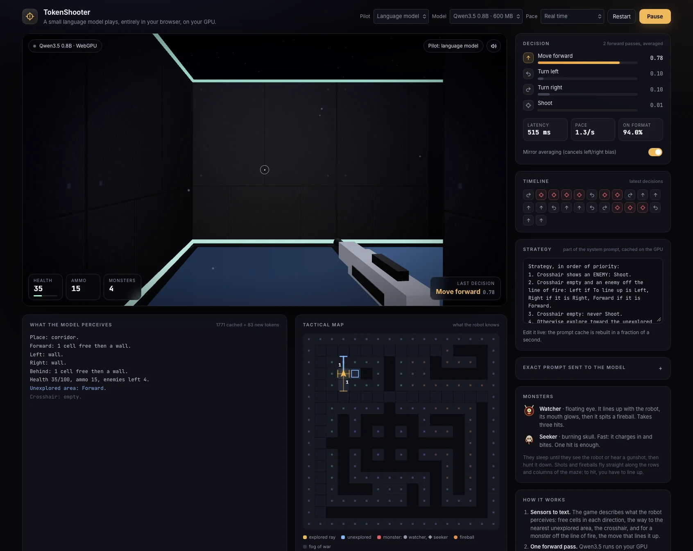

<p align="center"></p>
<h1 align="center">TokenShooter</h1>
<p align="center"><b>The first-token shooter.</b><br>A small language model plays a first-person shooter, entirely in your browser, on your GPU.</p>
<p align="center"><a href="#a-jev-like-model-in-your-browser">A <b>Jev-like</b> <i>System One</i> model</a>, in your browser: it decides without writing a word.</p>

<p align="center"></p>

There is no backend: the model (Qwen3.5) is downloaded once, then runs locally through WebGPU. Every move is a single token: the model writes nothing, the game reads the probability it gives to four words, Forward, Left, Right and Shoot, and plays the most likely one.

The level is a maze of corridors one cell wide, with a pillared hall in the middle, like the dungeon crawlers whose grid movement it borrows: there is no open floor, so moving cell by cell and shooting along the corridors always looks natural.

Nine monsters haunt the maze. They sleep until they see the robot or hear a gunshot, then hunt it down:

- **Watcher**: a floating demonic eye. It lines up with the robot, its mouth glows as it charges, then it spits a fireball. Takes three hits.
- **Seeker**: a burning skull. Fast, it charges in and bites. One hit kills it.

Shots and fireballs fly straight along the rows and columns of the maze, never diagonally, and never between two walls that touch at a corner. To hit a monster off its line of fire, the robot first has to line up with it; the game works out that move and names it in the text sent to the model.

Sound effects are synthesized in the browser (no audio files) and panned toward where each monster is.

## A Jev-like model, in your browser

In September 2026, TypeSafe AI released [Jev](https://en.wikipedia.org/wiki/Jev_(AI_model)), a model it calls a *System One model*: it writes no text, it reads a state and returns a typed decision with its probability, fast enough to play Doom in real time. Blocks.ai then [rebuilt the same API on an open model](https://blocks.ai/blog/jev-open-model-doom): Gemma 4 12B reads a text summary of the game and the probabilities of the letters A to Z, in about 110 ms on an M4 Mac with 24 GB of memory.

TokenShooter is Jev-like: it uses the same system, and takes it all the way to the visitor's machine:

- **Same principle.** The game describes what the robot perceives in text, the model runs a forward pass, and the game reads the probability of each answer. Nothing is generated.
- **No API, no server.** Qwen3.5 0.8B, a 600 MB download, runs on the visitor's GPU through WebGPU, inside the page.
- **Words, not letters.** A model this small ties letters to options poorly, so each answer is a word that is a single token: Forward, Left, Right, Shoot.
- **Fast enough for real time.** About 200 ms per decision with the 0.8B model on an M4 Pro in Chrome. On 200 graded situations, it picks a right move 98% of the time.

TokenShooter is an independent project, not affiliated with TypeSafe AI.

## Requirements

- A browser with WebGPU: Chrome or Edge 113+, Safari 26+, or Firefox 141+ on Windows and 145+ on Apple Silicon Macs.
- An internet connection for the first launch. The model is downloaded once (600 MB, or 1.4 GB for the 2B model), then your browser keeps it in its cache.

## Run it locally

You need [Node.js](https://nodejs.org) 22.12 or later.

```sh
npm install      # once
npm run dev      # starts the development server
```

Open the address it prints (http://localhost:8000) in Chrome or Safari, click **Download Qwen3.5 0.8B**, wait for the progress bar, then click **Start the game**. Saved changes to the code show up in the page straight away. Press `Ctrl + C` in the terminal to stop the server.

The server only hands the files to the browser: the model and the game both run in the browser.

## Using the demo

- **Pilot:** the language model, a rule-based bot (no download needed), or you with the keyboard (`↑`, `←`, `→`, `Space`).
- **Model:** Qwen3.5 0.8B (faster, 600 MB) or 2B (steadier, 1.4 GB). Nothing downloads until you click.
- **Pace:** real time (the default: monsters keep moving while the model thinks) or turn-based (the world waits for each decision, which makes the game much easier).
- **Strategy:** edit the rules given to the model while it plays. The prompt cache is rebuilt in under a second.
- **Mirror averaging:** scores each situation and its mirror image, then averages them to cancel the model's left/right bias. Turning it off halves the latency.

The page also accepts URL parameters, for example `http://localhost:8000/?pilot=bot&pace=live`:

| Parameter | Values |
|---|---|
| `pilot` | `model`, `bot`, `human` |
| `model` | `onnx-community/Qwen3.5-0.8B-ONNX-OPT`, `onnx-community/Qwen3.5-2B-ONNX-OPT` |
| `pace` | `turns`, `live` |
| `seed` | any number: changes how monsters patrol and when they flinch |
| `autostart` | starts right away, and with the model pilot, downloads the model without asking |

## Put it on a website

```sh
npm run build
```

This writes the site to `dist/`: an `index.html`, a favicon, an `assets/` folder and `third-party-licenses.md`, about 1.6 MB in all. That last file holds the licenses of the libraries and fonts bundled into the site: keep it with the site. Upload the content of `dist/` to any folder of a static host; the paths are relative, so it works outside the site root too. `npm run preview` serves `dist/` locally to check it first.

The site must be served over HTTPS, because browsers only enable WebGPU on secure pages (localhost is the exception). Each visitor's browser downloads the model from Hugging Face, and the ONNX Runtime WebAssembly engine from the jsDelivr CDN.

## Development

| Command | What it does |
|---|---|
| `npm run dev` | Development server, with the page reloading on every change |
| `npm test` | Unit tests (Vitest): the level, the wording rules of the prompts, the game balance |
| `npm run lint` | ESLint |
| `npm run simulate` | Balance report: the rule-based bot plays 200 games at each pace |
| `npm run build` | Production build into `dist/` |
| `npm run preview` | Serves the production build |
| `npm run check` | Lint, tests and build, one after the other: run it before publishing |

The game logic has no DOM: tests and simulations run it in Node, thousands of times faster than real time.

## Project structure

```
index.html             Page layout
assets/                Images for this README and the GitHub social preview
public/                Files copied as they are (favicon, logo)
src/
  main.js              Entry point: demo state, decision loop, frame loop, controls
  style.css            Styles
  game/                Rules and perception, no DOM (index.js lists the modules)
    level.js           The maze
    rules.js           Balance: health, ammo, monster stats, action durations
    prompts.js         Text sent to the model, system prompt, worked examples
    ...
  brain/
    worker.js          Web Worker: runs the model with Transformers.js, reads the answer probabilities
    client.js          Page side of the worker
    models.js          The models on offer
  render/              three.js: scene, monsters, particles, textures
  audio/               Sound effects, synthesized with the Web Audio API
  ui/                  HUD, panels, decision card, perception text, tactical map
tests/                 Unit tests
scripts/simulate.js    Balance report
```

To add a monster species: its stats in `src/game/rules.js` (`MONSTERS`) and a letter in `src/game/level.js` (`KINDS`), its 3D model in `src/render/monsters.js`, its cries in `src/audio/cries.js`.

## License

MIT, see [LICENSE](LICENSE). The Qwen3.5 models are not part of this repository: each visitor's browser downloads them from Hugging Face, under their own license.
